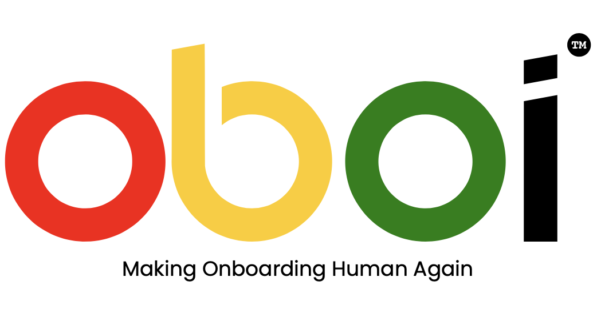

## ⌨️ oboi&trade; command line tool ##

Installs **oboi&trade;** as a CLI tool. 

Uses TORIDION's TQNN FraudTagger scoreUsername API to score a username or email against their enterprise fraud detection model.

## 🌟 Features 

⦿ **Email/Username scoring** against enterprise grade fraud detection API

⦿ **Free** to use upto 10 username searches per day

⦿ Integrates with MacOS, Linux and Windows 32/64 bit terminals

## 📧 Further development 

No notes

## 📧 Instructions 

Install using brew tap and call using ./oboi check  --apikey=<YOUR_API_KEY> <EMAIL>

**note** Replace <YOUR_API_KEY> with the supplied one from TORIDION if you have one. IF you have no key you can omit the --apikey argument completely and use the free tier **10 per day**. 

## 🔐 Free API Usage & Fair Use

**oboi&trade;** is free to use under the MIT license for personal, educational, and prototyping purposes.

Usage beyond this will require a valid API license key, please [view the API plans](https://toridion.com/oboi/) for license details for commercial use.

The source code may be modified and redistributed under the terms of the MIT license, but **abuse of the free API tier (e.g., illegal use, bulk use, bypassing limits or causing a nuisance to anyone)** may result in access being restricted without notice.

✅ TL;DR:
- You can use/modify/share the app
- API access is free up to 10/day
- For more, see [Pricing & Terms](https://toridion.com/oboi/)
